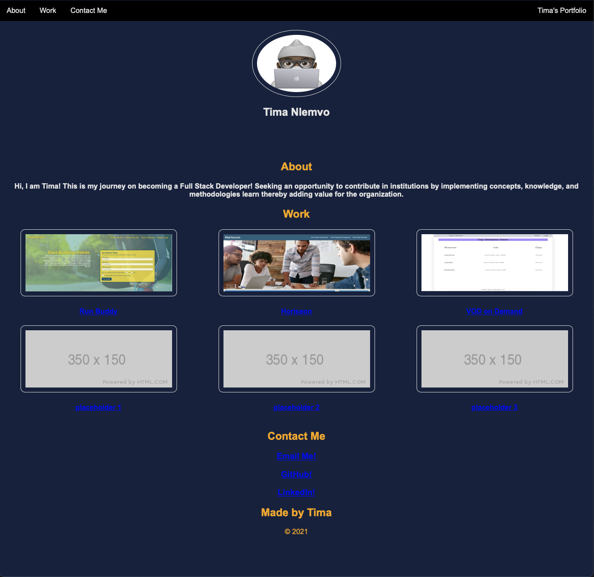

# Tee-Portfolio
Advanced CSS Challenge: Professional Portfolio

## Description
A portfolio page to showcase the skill and talent I possess for prospective employers.

## Link
[Tima's Portfolio](https://timanlemvo.github.io/Tee-Portfolio/)

## Screenshot

## Contributors
Github: [Tima Nlemvo](https://github.com/timanlemvo)

## Questions
Github: [Tima Nlemvo](https://github.com)  
Email: [Tima Nlemvo](timanlemvo@gmail.com)

“Whether you want to uncover the secrets of the universe, or you just want to pursue a career in the 21st century, basic computer programming is an essential skill to learn.”

-- Stephen Hawking